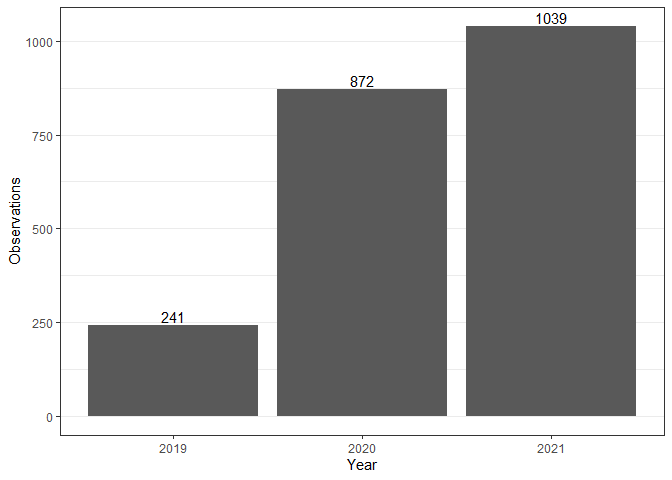
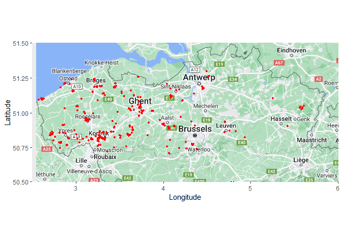

<!-- README.md is generated from README.Rmd. Please edit that file -->

# MyPackage

<!-- badges: start -->

[](https://github.com/sangovae/MyPackage/actions/workflows/R-CMD-check.yaml)

<!-- badges: end -->

The goal of `MyPackage` is to visualize the invasion of the invasive
Asian hornet *Vespa velutina* in Flanders.

`MyPackage` produces maps or bar charts per year of known observations.

The user defines the year range. Occurrences are retrieved from the
Global Biodiversity Information Facility (GBIF).

## Example

``` r
library(MyPackage)
data2019_2021 <- vespa_data(2019,2021)
data2019_2021
#> # A tibble: 2,152 × 118
#>    key        scientificName  decimalLatitude decimalLongitude issues datasetKey
#>    <chr>      <chr>                     <dbl>            <dbl> <chr>  <chr>     
#>  1 3031984510 Vespa velutina…            51.1             4.39 cdc,c… 50c9509d-…
#>  2 3044179393 Vespa velutina…            51.1             4.39 osiic  9a0b66df-…
#>  3 3044176410 Vespa velutina…            51.1             4.39 osiic  9a0b66df-…
#>  4 3044182405 Vespa velutina…            51.1             4.39 osiic  9a0b66df-…
#>  5 3044177373 Vespa velutina…            51.1             4.39 osiic  9a0b66df-…
#>  6 3044172499 Vespa velutina…            51.1             4.39 osiic  9a0b66df-…
#>  7 3044176590 Vespa velutina…            50.9             4.33 osiic  9a0b66df-…
#>  8 3039225614 Vespa velutina…            50.8             3.29 cdc,c… 50c9509d-…
#>  9 3039360956 Vespa velutina…            50.8             4.26 cdc,c… 50c9509d-…
#> 10 3044571232 Vespa velutina…            51.1             4.10 cdc,c… 50c9509d-…
#> # ℹ 2,142 more rows
#> # ℹ 112 more variables: publishingOrgKey <chr>, installationKey <chr>,
#> #   hostingOrganizationKey <chr>, publishingCountry <chr>, protocol <chr>,
#> #   lastCrawled <chr>, lastParsed <chr>, crawlId <int>, basisOfRecord <chr>,
#> #   occurrenceStatus <chr>, sex <chr>, lifeStage <chr>, taxonKey <int>,
#> #   kingdomKey <int>, phylumKey <int>, classKey <int>, orderKey <int>,
#> #   familyKey <int>, genusKey <int>, speciesKey <int>, …
```



    #> Scale for x is already present.
    #> Adding another scale for x, which will replace the existing scale.
    #> Scale for y is already present.
    #> Adding another scale for y, which will replace the existing scale.
    #> Warning: Removed 1 rows containing missing values (`geom_rect()`).


