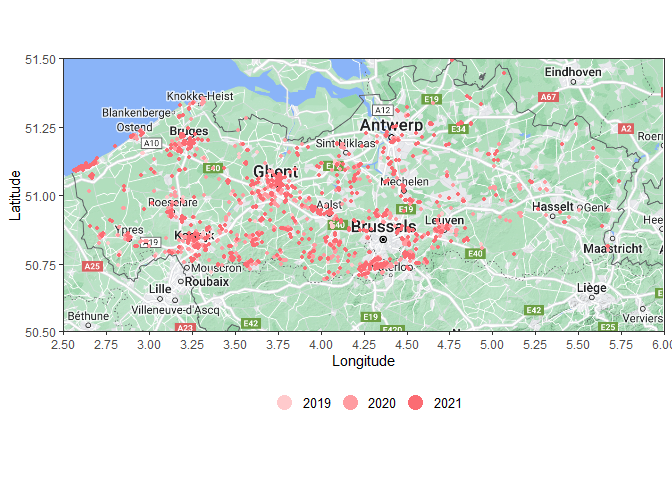

<!-- README.md is generated from README.Rmd. Please edit that file -->

# MyPackage

<!-- badges: start -->

[](https://github.com/sangovae/MyPackage/actions/workflows/R-CMD-check.yaml)

<!-- badges: end -->

The goal of MyPackage is to visualize the invasion of the invasive Asian
hornet (<em>Vespa velutina</em>) in Flanders.

MyPackage can produces maps or bar charts per year of known observations
of Asian hornets (Vespa velutina) in Flanders.

The user defines the year range. Occurrences are retrieved from the
Global Biodiversity Information Facility (GBIF).

## Example

``` r
library(MyPackage)
data2017_2019 <- vespa_data(2017,2019)
data2017_2019
#> # A tibble: 678 × 113
#>    key        scientificName  decimalLatitude decimalLongitude issues datasetKey
#>    <chr>      <chr>                     <dbl>            <dbl> <chr>  <chr>     
#>  1 2456495590 Vespa velutina…            51.2             2.96 cdc,c… 50c9509d-…
#>  2 2239541852 Vespa velutina…            51.2             2.96 osiic  9a0b66df-…
#>  3 2244281495 Vespa velutina…            51.0             3.11 cdc,c… 50c9509d-…
#>  4 2244281625 Vespa velutina…            50.8             3.04 cdc    50c9509d-…
#>  5 2269245719 Vespa velutina…            51.0             3.12 cdc    50c9509d-…
#>  6 2366150820 Vespa velutina…            51.1             2.62 cdc,c… 50c9509d-…
#>  7 2423221468 Vespa velutina…            51.2             3.53 cdc,c… 50c9509d-…
#>  8 2239541773 Vespa velutina…            51.0             3.12 osiic  9a0b66df-…
#>  9 2269431918 Vespa velutina…            50.8             3.04 osiic  9a0b66df-…
#> 10 2239541849 Vespa velutina…            51.1             3.52 osiic  9a0b66df-…
#> # ℹ 668 more rows
#> # ℹ 107 more variables: publishingOrgKey <chr>, installationKey <chr>,
#> #   hostingOrganizationKey <chr>, publishingCountry <chr>, protocol <chr>,
#> #   lastCrawled <chr>, lastParsed <chr>, crawlId <int>, basisOfRecord <chr>,
#> #   occurrenceStatus <chr>, taxonKey <int>, kingdomKey <int>, phylumKey <int>,
#> #   classKey <int>, orderKey <int>, familyKey <int>, genusKey <int>,
#> #   speciesKey <int>, acceptedTaxonKey <int>, acceptedScientificName <chr>, …
```


    #> Scale for x is already present.
    #> Adding another scale for x, which will replace the existing scale.
    #> Scale for y is already present.
    #> Adding another scale for y, which will replace the existing scale.
    #> Warning: Removed 1 rows containing missing values (`geom_rect()`).


